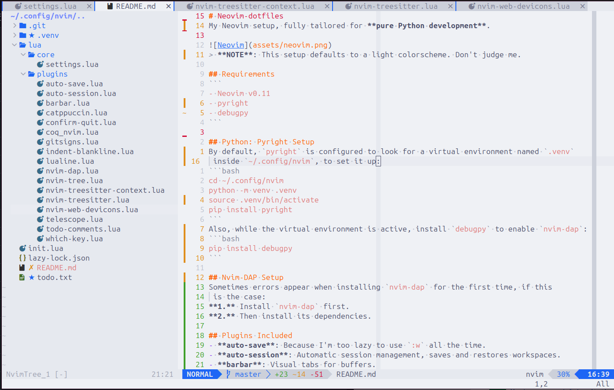

# Neovim-dotfiles
My custom Neovim configuration.


> **NOTE**: This setup uses a light colorscheme by default.

## Requirements
```
- Neovim v0.11
- pyright (Optional)
- clangd >= 12 (Optional)
```

## Project Structure
```
nvim/
├── init.lua                       # Loads settings and bootstraps plugins.
├── README.md                      # You're reading it.
├── after/                         # Overrides default Neovim behavior.
│   └── ftplugin/                  # Filetype-specific settings.
│       ├── c.lua                  # Custom indentation for C files.
│       ├── markdown.lua           # Custom indentation for Markdown files.
│       └── python.lua             # Custom indentation for Python files.
├── lsp/                           # Per-language LSP configurations.
│   ├── clangd.lua                 # Custom configurations for Clangd.
│   └── pyright.lua                # Custom configurations for Pyright.
└── lua/                           # Main configuration directory.
    ├── lsp/                       # LSP-related configurations.
    │   ├── init.lua               # Loads and sets up all LSP-related modules.
    │   ├── completion.lua         # Configures autocompletion behavior.
    │   └── diagnostic.lua         # Customizes diagnostic display.
    ├── plugins/                   # Plugin-specific configurations.
    │   ├── init.lua               # Dynamically loads plugin configs.
    │   ├── catppuccin.lua         # Colorscheme configuration.
    │   ├── gitsigns.lua           # Git status indicators for the sign column.
    │   ├── markdown-preview.lua   # Markdown preview utility.
    │   ├── neoscroll.lua          # Enables smooth scrolling behavior.
    │   ├── nvim-colorizer.lua     # Highlights hex/RGB color codes in buffers.
    │   ├── nvim-treesitter.lua    # Syntax highlight and parsing via Treesitter.
    │   ├── nvim-web-devicons.lua  # Provides file-type icones.
    │   └── todo-comments.lua      # Highlights TODO, WARN etc. in code comments.
    ├── settings/                  # Core Neovim settings.
    │   ├── init.lua               # Loads all settings modules.
    │   ├── autocmds.lua           # Defines custom autocommands.
    │   ├── general.lua            # General settings.
    │   ├── indent.lua             # Default/global indentation settings.
    │   ├── keybinds.lua           # Custom key mappings.
    │   └── statusline.lua         # Custom statusline setup.
    └── bootstrap.lua              # Plugin manager setup.
```

## Colorscheme
If you prefer to use a different colorscheme instead of `catppuccin`, you must
 manually define the same highlight groups used in `lua/plugins/catppuccin.lua`
 to ensure consistent UI elements (especially the statusline and diagnostics).

## Python: Pyright Setup
By default, `pyright` is configured to look for a virtual environment named
 `.venv` in the root of this project. To set it up:
```bash
cd ~/.config/nvim
python -m venv .venv
source .venv/bin/active
pip install pyright
```
If you want to use a global pyright or change how it's invoked, edit the
 settings in `lsp/pyright.lua`.

## C/C++: Clangd Setup
Clangd uses default options, so no extra configuration is required, just make
 sure `clangd` is installed. If needed, you can tweak its behavior in
 `lsp/clangd.lua`

## TO-DOs
- [ ] Add a fallback for `nvim-web-devicons` in the statusline (default to
 `%Y`, `""`, or something).
- [ ] Add screenshots of the setup, this might make someone's life easier.
- [ ] Add code folding support.
- [ ] Be happy with me neovim config.
